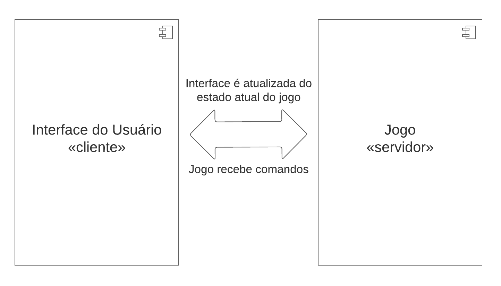
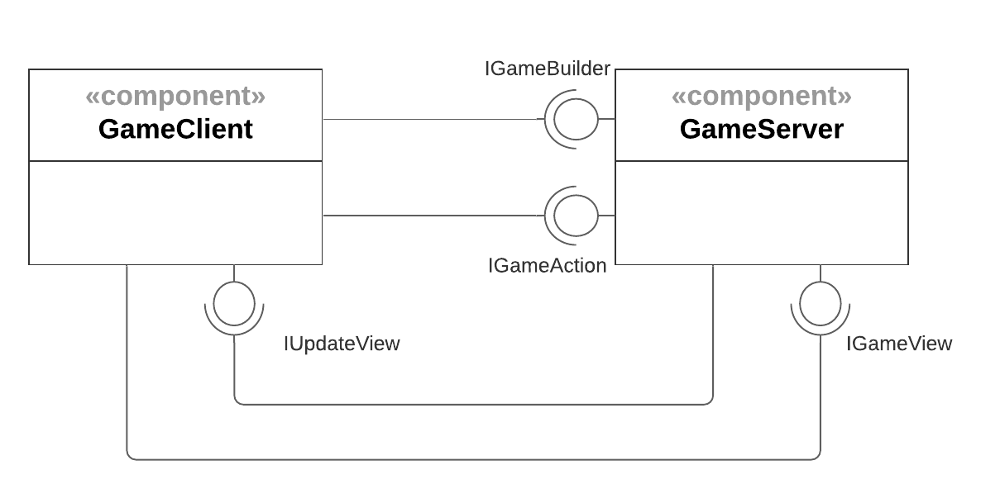
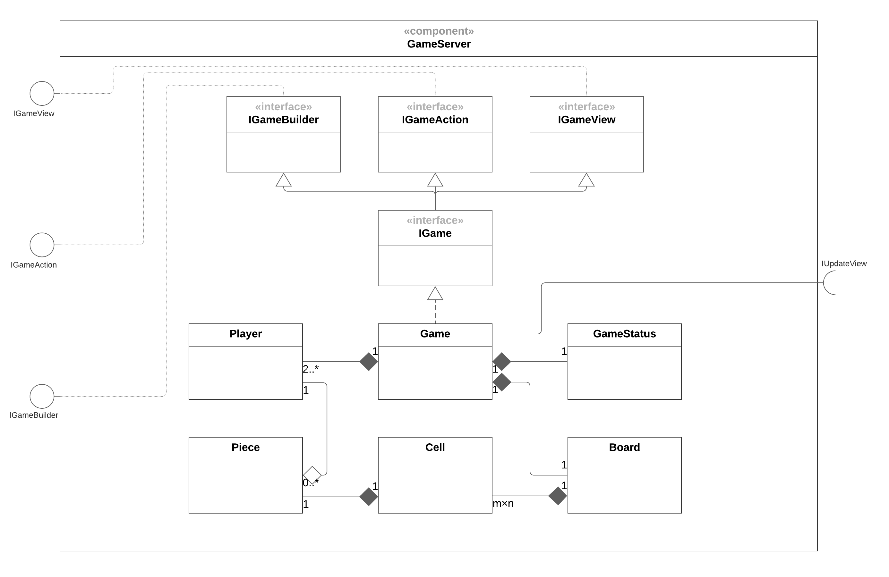
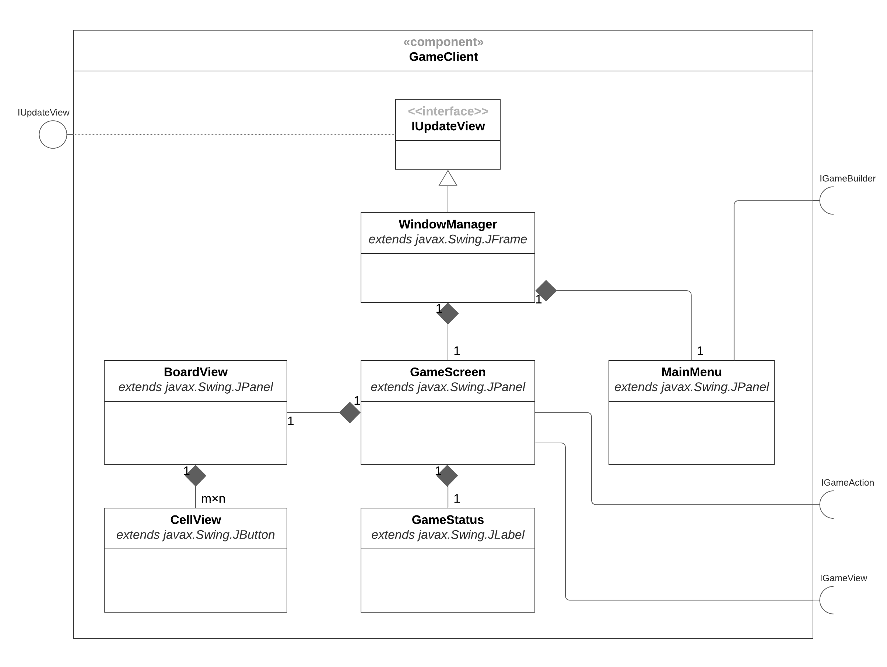
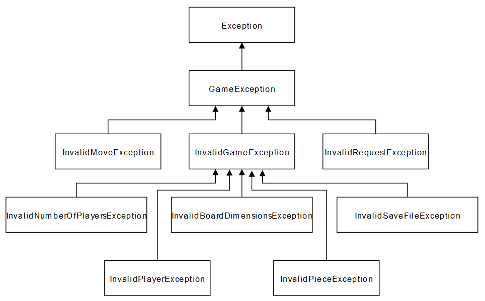

# Projeto _Taalt!_

## Descrição Resumida do Projeto

_Taalt!_, como foi batizado pela nossa equipe, é um jogo inspirado em uma classe abstrata de jogos de tabuleiros, conhecida como _Jogo ❬m, n, k❭_. Trata-se de uma generalização matemática do famoso jogo da velha (ou Tic-Tac-Toe), de modo que os parâmetros da partida podem ser variados.

De forma resumida, um jogo ❬m, n, k❭ possui um tabuleiro celular com as dimensões m × n, cujas células podem ser preenchidas por uma única peça cada, que por sua vez tem cores ou símbolos diferentes para cada um dos jogadores envolvidos. A condição de vitória é que um dos jogadores coloque *k* peças suas em sequência, seja na horizontal, na vertical, ou na diagonal.

Além dessas características, _Taalt!_ ainda possui alguns elementos que distinguem sua jogabilidade. Dentre tais elementos, incluem-se a possibilidade de jogar com ou sem gravidade (que faz as peças caírem para alguma direção), o número variável de jogadores, e um tabuleiro independente do tipo de visualização, tornando o game portátil para múltiplas formas de visualização.


## Equipe
* Daniel Credico de Coimbra
* Daniel Paulo Garcia


## Vídeos do Projeto
* [Vídeo da Prévia](assets/Prévia_Vídeo.mp4)
* [Vídeo da Apresentação Final](assets/Final_Vídeo.mp4)


## Slides do Projeto
* [Slides da Prévia](assets/Prévia_Slides.pdf)
* [Slides da Apresentação Final](assets/Final_Slides.pdf)


## Relatório de Evolução
O projeto foi submetido a sucessivas rodadas de aprimoração de encapsulamento. Um processo digno de nota foi a familiarização com o conceito de interface.

A versão inicial possuía um par de interfaces, uma provida e uma requerida, para cada interação entre classes. Avanços na compreensão de interfaces eliminaram-nas de dentro de cada componente. Percebemos ser natural que cada componente seja internamente interdependente, com suas classes tendo acesso direto umas às outras, no máximo por meio de getters e setters.

Um passo posterior foi a eliminação da implementação de interfaces requeridas. Se A e B se comunicavam, implementavam respectivamente IProvida e IRequerida. O notável é que A, que provê a interface, teria um ponteiro para objetos que implementem IRequerida. Todavia, os componentes mais diversos poderiam requerer serviços de A, sem necessariamente se conformarem com uma interface única IRequerida. Eliminar IRequerida tornou A mais independente; A possui conhecimento apenas de IProvida.

Um segundo processo digno de nota foi a deliberação acerca do uso de eventos para a comunicação Servidor-Cliente, implementando o _pattern_ Subject-Observer especificamente por meio de eventos. Todavia, como nosso cliente e nosso servidor não possuem atividades assíncronas, o sistema de eventos se provou desnecessário, e o _pattern_ Subject-Observer foi feito de maneira síncrona, sem eventos.

Tais foram duas mudanças de arquitetura. Houve também mudanças de implementação. Ações do usuário eram enviados pelo Cliente ao Servidor por meio de um objeto `Input`, inicialmente simples mas arbitrariamente expansível. Todavia, como os inputs são potencialmente muito diversos, decidimos desmembrar os componentes de `Input` em termos de vários métodos da interface `IGameAction`, de modo que cada tipo de input corresponde a um método.

Uma segunda mudança de implementação foi a que segue. A versão final contém no Servidor objetos `Piece` e `Player` com pouca informação interna, podendo razoavelmente ter sido armazenadas em objetos `Cell`, mas decidimos por manter essa segmentação para facilitar futuras expansões quanto às propriedades individuais de peças e jogadores. Por exemplo, jogadores poderiam pertencer a diferentes classes ou raças, possuindo então diferentes poderes. Também poderiam haver diferentes tipos de peças, com diferentes poderes.

A última mudança de implementação que destacaremos tratou da exibição de janelas Swing. O menu principal e o tela do jogo eram armazenados em extensões distintas de `JFrame`, com a alteranação entre os dois sendo feitas por um controlador não-Swing mediante o fechamento e a abertura de janelas do sistema operacional. Para permitir que o jogo ocorra todo em uma tela, o controlador se tornou uma extensão de `JFrame`, com o menu e tela de jogo se tornando extensões de `JPanel` sendo alternadamente exibidas no controlador.

No todo, a evolução do jogo espelhou a evolução da equipe como projetistas de uma arquitetura orientada a objetos que fosse expansível.

## Destaque de Código
Métodos de `gameserver.Options`.
```
public Options() {
    this.inputFields = new String[]{"numPlayers", "nameList", "m", "n", "k", "gravityMode"};
    ...
}

public int getInputCount() {
    return this.inputFields.length;
}

public String getInputID(int index) {
    return this.inputFields[index];
}
    
public String getDisplayText(String inputID) {
    return switch (inputID) {
        case "numPlayers" -> "Number of players";
        case "nameList" -> "Player names (comma-separated)";
        case "m" -> "Rows (m)";
        ...
    };
}

public void setOption(String inputID, String inputText) {
    switch (inputID) {
        case "numPlayers" -> this.setNumPlayers(inputText);
        case "nameList" -> this.setPlayerNames(inputText);
        case "m" -> this.setM(inputText);
        ...
    };
}
```
A classe Options possui uma listagem interna dos parâmetros configuráveis do jogo (atributo "inputIDs"). Isso permite ao cliente construir dinamicamente a página de configuração de jogo, ao iterar sobre a lista de parâmetros: a quantidade é dada por .getInputCount() e cada inputID é acessado por .getInputID().

O cliente oferece ao usuário informação sobre os parâmetros via .getDisplayText(), sem nenhum conhecimento _hard-coded_ de tais parâmetros por parte do cliente. Para inserir o input do usuário, o cliente então acessa apenas o método .setOption(), que internamente chamará as funções apropriadas para ajustar os parâmetros.

Isso tudo possibilita que alterações significativas no jogo sem que o código do cliente tenha que ser alterado.

## Destaque de Pattern

### Pattern: Subject-Observer dentro de Client-Server
#### Diagrama do Pattern

#### Código do Pattern
Código completo de uma interface:
```
public interface IUpdateGameView {
    void updateGameStatus();
    void updateCell(Point cellCoordinates);
}
```
Trecho de código em gameserver.Game, executado sempre que o servidor atualiza seu estado interno:
```
for (IUpdateGameView gameView: this.gameViewerList) {
    gameView.updateGameStatus();
    gameView.updateCell(pos);
}
```
O servidor Game (sujeito) possui uma lista de clientes IUpdateGameView (observadores) que esperam por uma notificação de que algo foi atualizado, seja o estado interno do jogo, seja o estado interno de uma célula do jogo. Após tal notificação, os clientes perguntam ao servidor qual seu estado atual, por meio da interface provida pelo servidor IGameView.

O servidor do jogo (_Model_) é inteiramente encapsulado da interface gráfica de usuário (_View_); basta que o cliente forneça a interface IGameScreen (que estende IUpdateGameView). Similarmente, o cliente interage com o servidor por meio da interfae IGame.

## Conclusões e Trabalhos Futuros
_Planejamento_ e _projeto_: as principais habilidades cultivadas ao longo do projeto. A exigência de entrega precoce de diagramas detalhados nos forçou a planejar antes de escrever a primeira linha de código, algo que poupou muitas horas de refatoramento.

A divisão nítida entre Cliente e Servidor permite que o jogo seja substancialmente alterado em apenas uma ponta: o Servidor, pois o Cliente é construído com base nas informações do Servidor.

Dentro tanto do Cliente quanto do Servidor, a arquitetura é bem-segmentada, de forma a ser facilmente expansível.

Muitos dos aprimoramentos que gostaríamos de fazer tangem à parte gráfica. Por exemplo, gostaríamos que os jogadores pudessem escolher os símbolos que representam suas peças, ou até desenhá-los em um canvas.

Outros aprimoramentos tratam da funcionalidade do jogo. Por exemplo, dado que o tabuleiro, as casas, as peças, e os jogadores são armazenados separadamente, é facilitada a customização de habilidades de jogador e modos de jogo. Gostaríamos que houvesse diferentes raças para os jogadores, com poderes distintos tais como: expandir / contrair o tabuleiro, inserir bombas-relógio que apagam peças em área, duplicar peças a posições adjacentes, e assim por diante.

Infelizmente, a maior parte do tempo de desenvolvimento foi (bem) investido em preocupações de projeto e arquitetura, correspondendo às intenções principais do curso de orientação a objetos. Consequentemente, por ora, _Taalt!_ não é um jogo expansivo, mas foi feito de maneira bastante _expansível_, o que já configura uma conquista.


## Documentação dos Componentes

### Diagramas

#### Diagrama Geral do Projeto
Tentamos empregar um misto dos estilos arquiteturais Cliente-Servidor (como mostra a figura) e do Model-View-Controller, ficando View e Controller a cargo da Interface do Usuário, enquanto que o Model é gerido pelo servidor do Jogo.



#### Diagrama Geral dos Componentes
Conforme o _pattern_ destacado acima, o componente GameClient é responsável pela visualização do jogo e por enviar comandos do usuário. Já no componente GameServer há elementos do modelo do jogo. GameServer é projetado para funcionar de maneira completamente independente de um componente gráfico, sendo portanto acoplável a qualquer outro modo de visualização.


#### Diagrama dos Componentes de GameServer
Gerencia e atualiza o estado atual do jogo.



#### Diagrama dos Componentes de GameClient
Visualização da partida, interface de input, e controlador de janelas.




## Componentes

### Componente `GameServer`
Este componente possui uma classe principal Game que administra as operações recebidas do usuário. Um componente externo tanto pode enviar comandos pela interface IGameAction, quanto também requerer informações do jogo via IGameView. O componente admite observadores (observers/listeners) que serão avisados automaticamente de quaisquer mudanças no estado interno do jogo, via interface requerida IUpdateView. Por fim, Game é criado recebendo informações das opções da partida através da interface IGameBuilder.

**Ficha Técnica**
item | detalhamento
----- | -----
Classe | `gameserver.GameServer`
Autores | `Grupo Daniel x Daniel`
Interfaces | `IGameBuilder, IGameAction, IGameView`

**Interfaces associadas**
Interface agregadora do componente em Java:
~~~java
public interface IGame extends IGameBuilder, IGameAction, IGameView {
}
~~~

## Detalhamento das Interfaces (Game Controller)
### Interface `IGameBuilder`
Permite a inicialização de GameServer.
~~~java
public interface IGameBuilder {
  void build(Options input);
}
~~~
Método | Objetivo
-------| --------
`build` | `Recebe um objeto Options com as especificações da partida e constrói os objetos necessários.`

### Interface `IGameAction`
Permite a entrada de um input.
~~~java
public interface IGameAction {
  void command(Input input);
}
~~~
Método | Objetivo
-------| --------
`command` | `Recebe um objeto Input especificando uma tentativa de jogada.`

### Interface `IGameView`
Resumo do papel da interface.

~~~java
import gameserver.Output;

public interface IGameView {
    Output getCell(Point pos);
}
~~~
Método | Objetivo
-------| --------
`getCell` | `Recebe as coordenadas de uma célula e devolve informações sobre ela e sobre o estado atual do jogo, encapsuladas num objeto gameserver.Output.`


### Componente `GameClient`
Este componente possui uma classe WindowManager que administra a criação e exibição das janelas MainMenu, onde o usuário insere opções e pode inicializar o jogo, e GameScreen, onde uma partida é exibida e na qual se pode interagir com o tabuleiro. WindowManager serve como ponto de entrada de nosso programa, e por meio da interface requerida IGameBuilder é possível criar um jogo. Inputs serão inseridos via IGameAction e atualizações sobre o tabuleiro serão sinalizadas via IUpdateView e obtidas via IGameView.


**Ficha Técnica**
item | detalhamento
----- | -----
Classe | `gameclient.GameClient`
Autores | `Grupo Daniel x Daniel`
Interfaces | `IUpdateView`

## Detalhamento das Interfaces

### Interface `IUpdateView`
Resumo do papel da interface.
~~~java
public interface IUpdateView {
  void notify();
}
~~~
Método | Objetivo
-------| --------
`notify` | `Notifica os observadores (tabuleiro e suas células) que uma atualização interna ocorreu.`


## Plano de Exceções

### Diagrama da hierarquia de exceções


### Descrição das classes de exceção
Classe | Descrição
----- | -----
GameException | Abarca todas as exceções relacionadas ao servidor do jogo (exceto interface gráfica).
InvalidMoveException | Indica tentativa inválida de jogada por parte do jogador.
InvalidRequestException | Indica requisição inválida de informações do jogo por parte da interface gráfica.
InvalidGameException | Engloba todas as exceções relacionadas à configuração da partida.
InvalidNumberOfPlayersException | Indica quantia selecionada inválida de jogadores.
InvalidBoardDimensionException | Indica dimensão selecionada inválida de tabuleiro.
InvalidSaveFileException | Indica que o _save file_ está corrompido.
InvalidPlayerException | Indica que o jogador não está configurado adequadamente.
InvalidPieceException | Indica que a peça não está configurada adequadamente.
